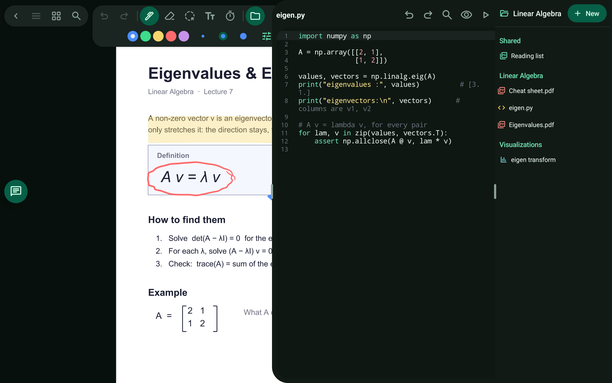

# Code

Edit and run code on the same device.

> 🎬 Video: coming soon

## What it does

- A code editor with line numbers, syntax highlighting, auto-indent, find and replace, and undo/redo.
- Run scripts on the connected computer and see the result next to your notes.
- The agent can edit your files and run scripts for you.

Related: [Ask the agent](ask-the-agent.md)

[← All features](README.md)
