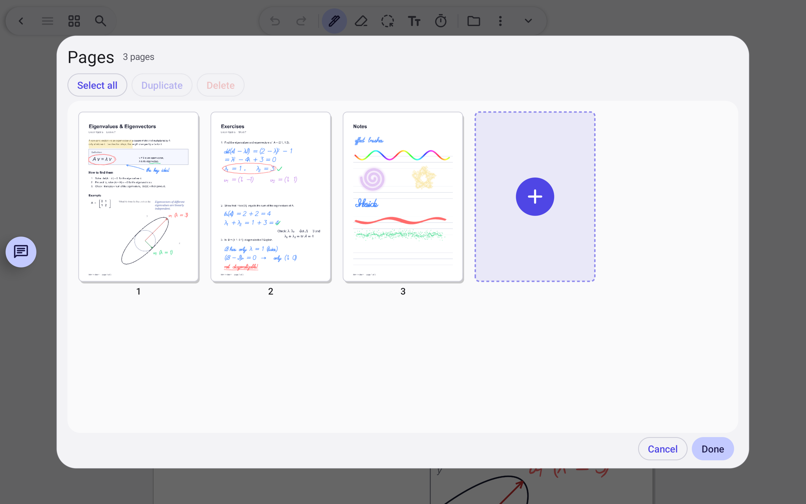

# Pages and export

Rearrange a document and get a normal PDF back.

> 🎬 Video: coming soon

## What it does

- See all pages as thumbnails; reorder, duplicate or delete them.
- Export PDF stamps your ink, images and text onto a copy, so you can share it anywhere.
- Blank pages can be added at the end of any document.

Related: [Write on PDFs](write-on-pdfs.md)

[← All features](README.md)
