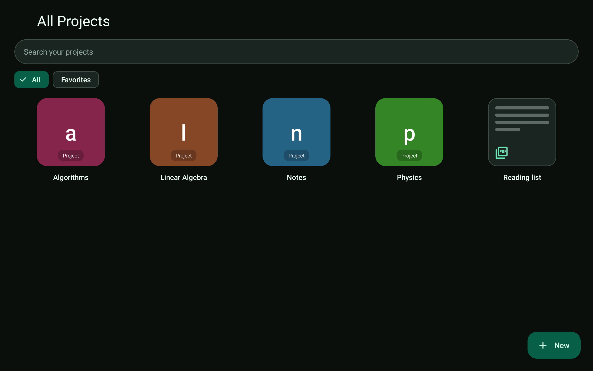
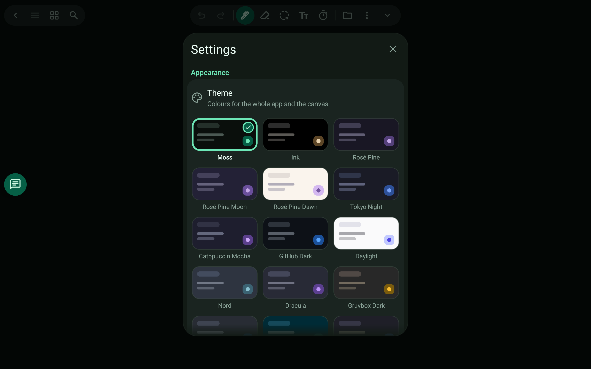

# Projects and themes

Keep subjects apart and make the app yours.

> 🎬 Video: coming soon

## What it does

- Projects group documents, code and visualizations; the library shows them all.
- PDFs not in any project are listed as shared.
- 40+ colour themes, light and dark. The PDF stays as uploaded; the app follows the theme.

Related: [Study week](study-week.md)

[← All features](README.md)
