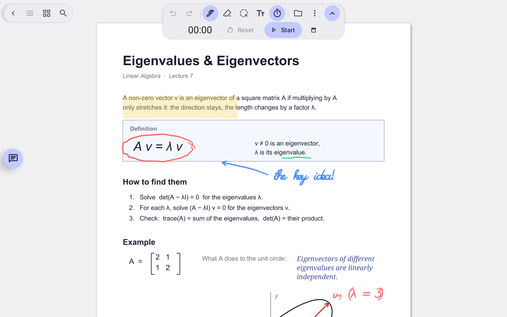
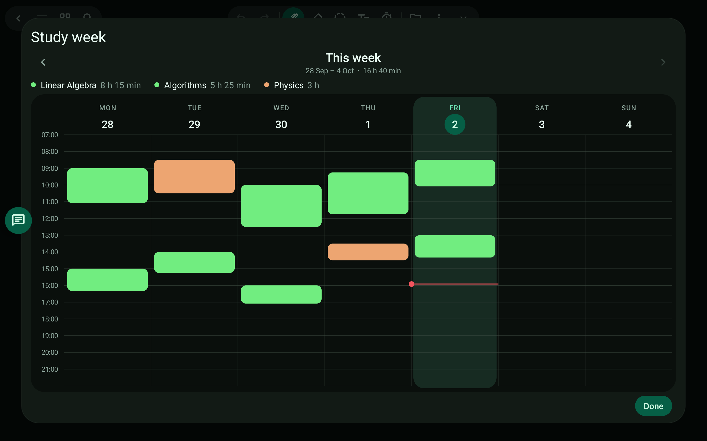

# Study week

See when you studied.

> 🎬 Video: coming soon

## What it does

- Start the timer while you work. Each stretch is logged.
- The weekly view shows rounded blocks coloured by project, with time per project and past weeks one swipe away.
- Study sessions are kept per device.

Related: [Projects and themes](projects-and-themes.md)

[← All features](README.md)
