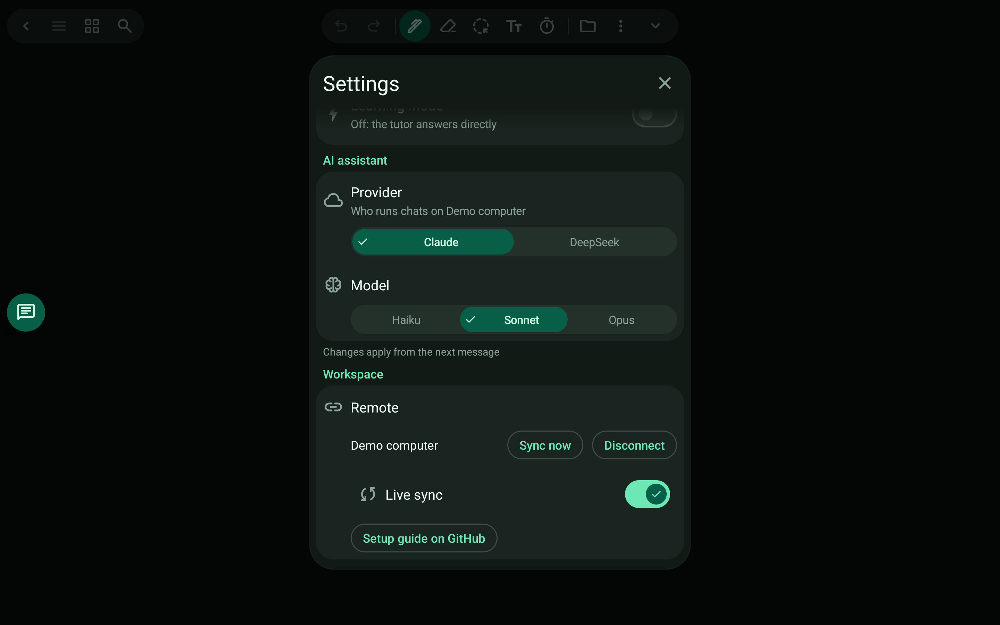

# Sync across devices

Work on the tablet, check on the phone: every device has the same documents, without thinking about it.

> 🎬 Video: coming soon

## What it does

- Documents live on your device. Connect a computer once and the app keeps a copy of your workspace there, in the background.
- Connect your phone (or another tablet) to the same computer and it receives the same documents, ink and chats. Do the heavy writing on the tablet; read, search and ask questions on the phone.
- Live sync follows changes within seconds; switch it off and tap Sync now if you prefer.
- If both sides changed a file, the newer one wins and the other is kept as "name (conflict).ext". Nothing is silently lost.
- No Inkside account is needed: you type the computer's address. It works on the same Wi-Fi, over Tailscale, or over the internet with an access token.
- Undo history stays on each device.

Set it up in [Connecting a computer](../connecting.md).

[← All features](README.md)
