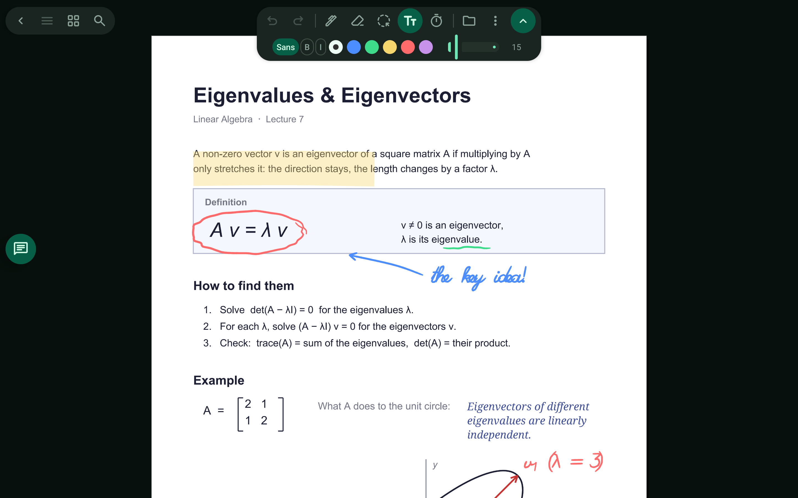
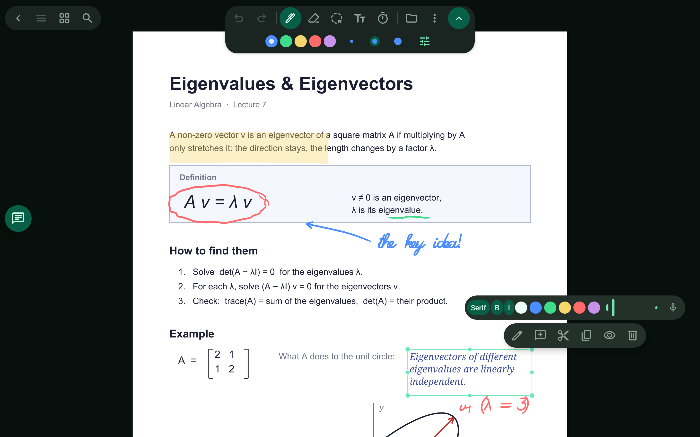
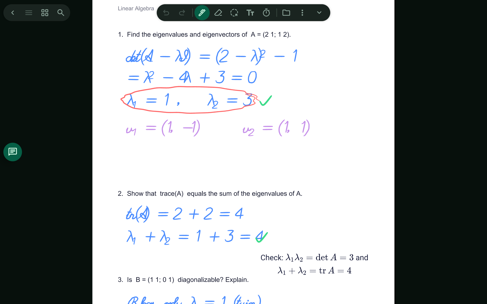

# Text and LaTeX

Type next to your handwriting, including typeset maths.

> 🎬 Video: coming soon

## What it does

- Add text boxes anywhere on the page: choose font, bold, italic, colour and size.
- Tap a selected box (or double-tap) to edit it in place.
- Write maths in LaTeX and see it typeset beside a handwritten solution.
- Selecting a box shows a style bar and actions.

Related: [Ask the agent](ask-the-agent.md)

[← All features](README.md)
