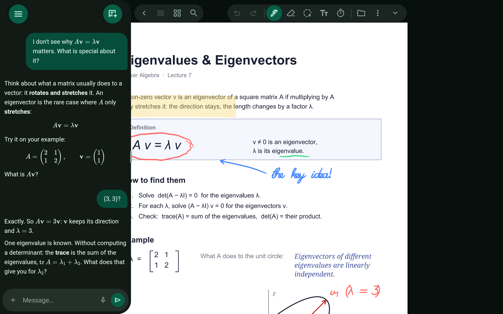

# Tutor

An AI that asks before it tells.

> 🎬 Video: coming soon

## What it does

- Instead of dumping answers, the tutor asks what you already think and builds from there.
- Works from the document you have open and the things you marked.
- Conversations are saved with the document.

Related: [Ask the agent](ask-the-agent.md)

[← All features](README.md)
