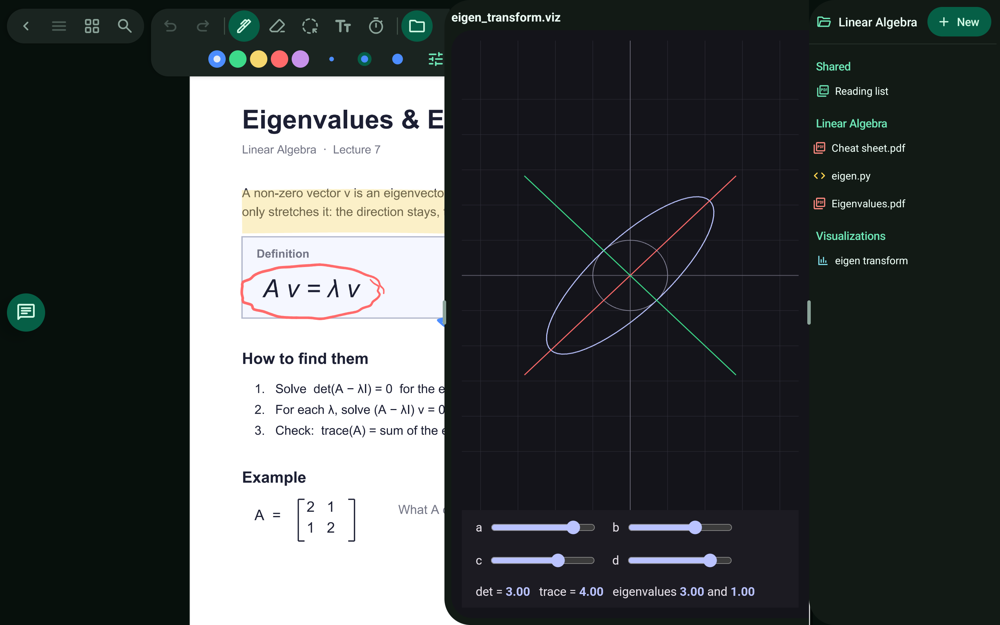
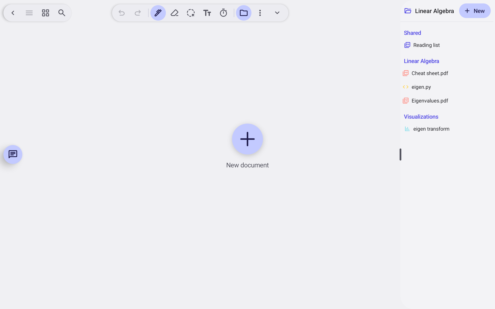

# Visualizations

Interactive pages the agent builds to explain something.

> 🎬 Video: coming soon

## What it does

- Ask for a visualization of a concept; the agent makes an interactive page.
- They are saved per project and listed in the explorer.

Related: [Ask the agent](ask-the-agent.md)

[← All features](README.md)
