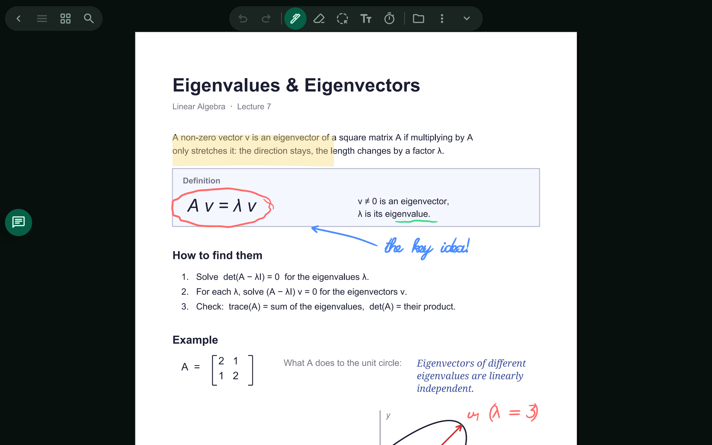
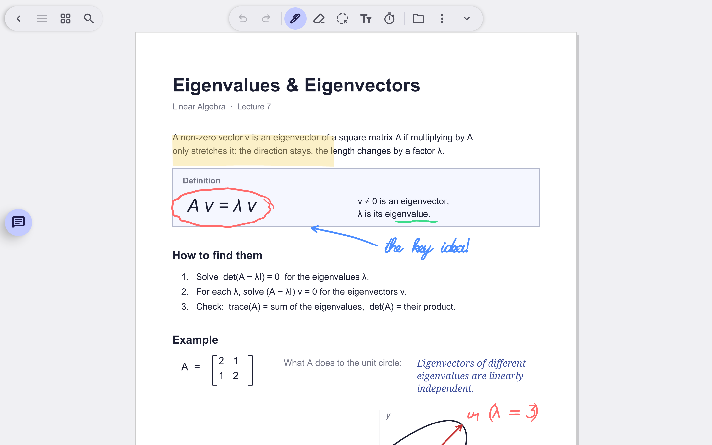

# Write on PDFs

Lecture slides, textbooks and papers stay as they are. Your notes go on top.

> 🎬 Video: coming soon

## What it does

- Open or import a PDF and write on it with the stylus: pen, highlighter, typed text.
- Your marks are kept separately from the PDF, so the original is never changed until you export.
- Scrolling past the last page adds a blank page. Pages are stacked, so you scroll through a document.
- Stylus draws and erases; a finger pans and pinch-zooms.

Related: [Pages and export](pages-and-export.md), [Pen and brushes](pen-and-brushes.md)

[← All features](README.md)
