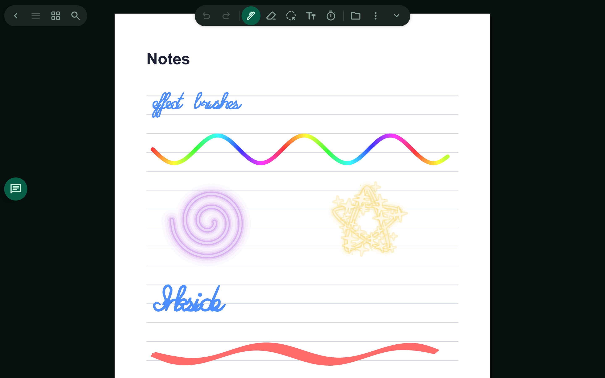
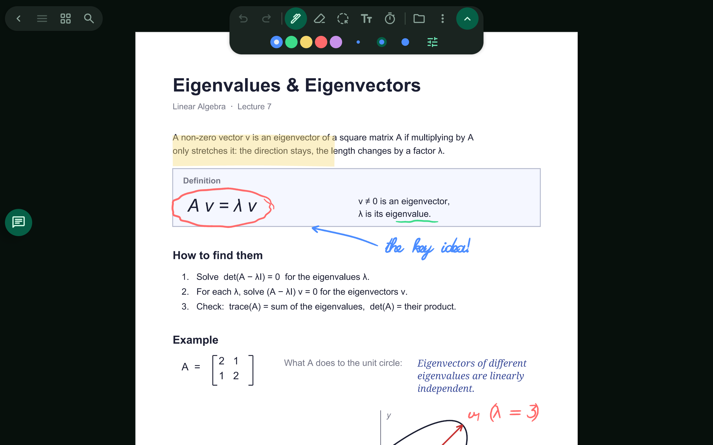
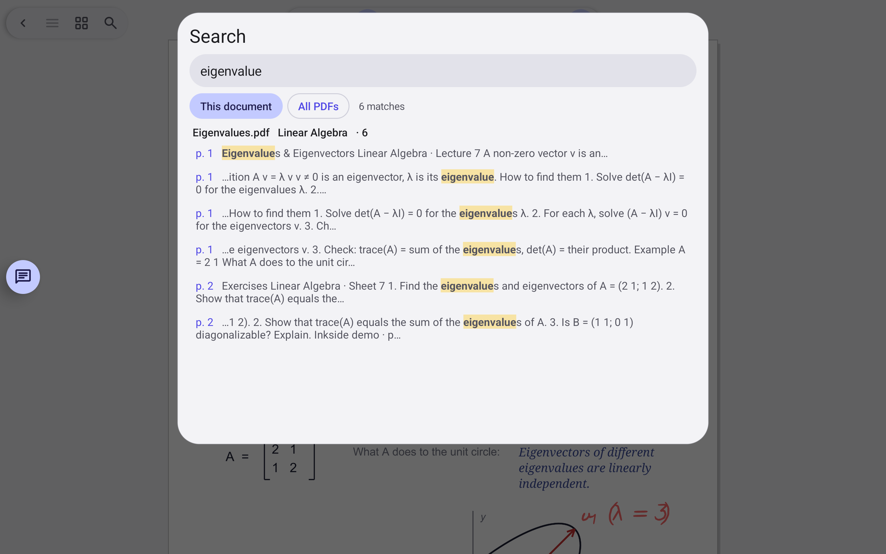
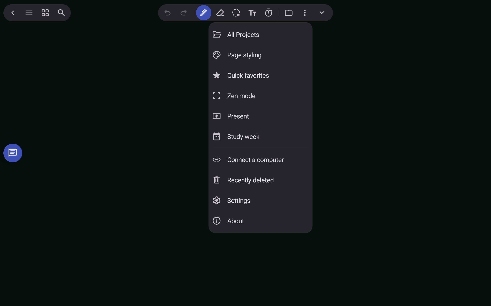
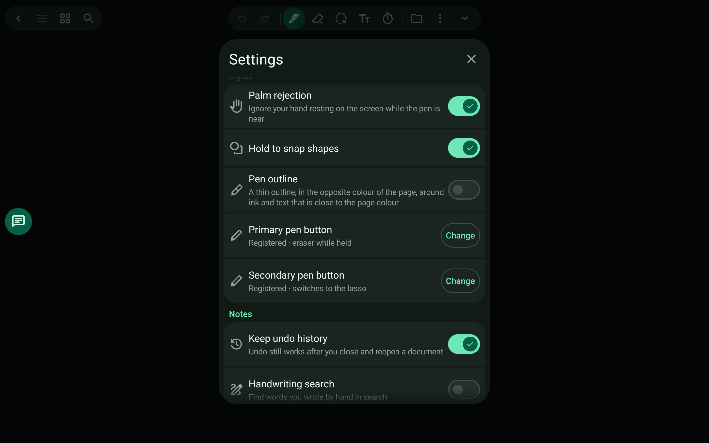

# Inkside screenshots

A tour of the app on a tablet, using the demo workspace described at the end. Handwriting and text in
the demo are example content; everything else is the app as it is.

## Documents and ink

| | |
|---|---|
|  |  |
| **A PDF, marked up by hand** — ink, highlighter, and typed text on the page; dark theme | **Same page, light theme** — the PDF stays as uploaded, the app follows the theme |
|  |  |
| **Handwriting and LaTeX** — a worked solution, with a typeset note beside it | **Effect brushes** — rainbow, glow, sparkle, calligraphy and spray |

## Tools

| | |
|---|---|
|  |  |
| **Pen** — colours and three quick sizes | **Text** — font, style, colour, size |
|  |  |
| **Selection** — style bar and actions for the selected box | **Pages** — reorder, duplicate or delete pages |

## Agent, code and visualizations

| | |
|---|---|
|  |  |
| **Chat** — the tutor asks before it tells, in LaTeX, next to your document | **Visualizations** — interactive pages the agent made, per project |
|  |  |
| **Code editor** — highlighting, find, run | **Search** — the text of your PDFs, with the matches highlighted |

## Everything else

| | |
|---|---|
|  |  |
| **Library** — projects and shared PDFs | **Study week** — when you studied, by project |
|  |  |
| **Timer** — feeds the study week | **Explorer** — the project's files and visualizations |
|  |  |
| **Menu** | **Themes** — 40+ colour themes |
|  |  |
| **Stylus** — palm rejection, snap, pen outline, pen buttons | **Remote** — the connected computer, live sync, setup guide |

## How these were made

The demo workspace is generated by a script: PDFs from `pdf-lib`, handwriting from a single-stroke script
font turned into ink strokes, and a host serving that folder to a clean copy of the app (the
`DEMO_ID` build option in `app/build.sh` builds a second install with its own data).
